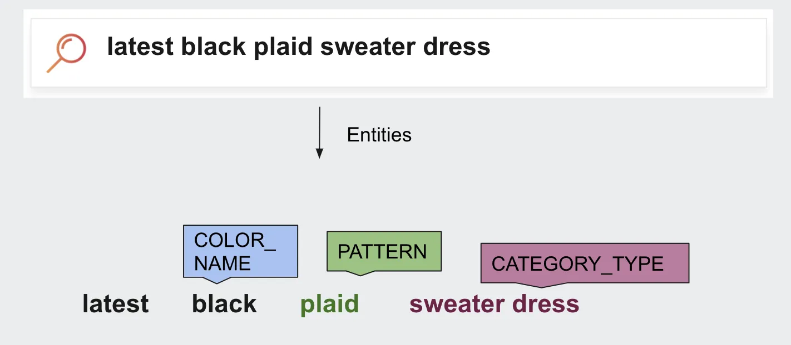

# Named-Entity Recognition (NER)

Named-Entity Recognition (NER) or Entity Extraction, scans search queries to identify and classify words or phrases into predefined categories, such as names of people, brands, products, locations, styles, colors, quantities, monetary values, percentages, and many other features.
These predefined categories (mostly) represent real-world objects and are described by proper nouns.

Consider the search query `latest black plaid sweater dress`.
Here the product attributes, or features are the `latest`, `black`, `plaid`, and `sweater dress`.
The output of NER may be `latest black_color plaid_pattern sweater_dress_category_type`; where `color`, `pattern`, and `category_type` are the predefined categories, and `black`, `plaid`, and `sweater dress` are their values.

  

In this process, the NER algorithm extracted the entities' `black`, `plaid`, and `sweater dress` and put them into their respective categories.

For example, in the query `Calvin Klein shoes`, the NER model may identify `Calvin Klein` as a brand name and `shoes` as a product type.

Similarly, in the query `brown shoe polish`, `shoe polish` should be extracted as one compound entity, which is the product type here.
If the entity isn't recognized as a compound token, results may contain `shoes`, `nail polish`, or anything that matches the individual keyword.